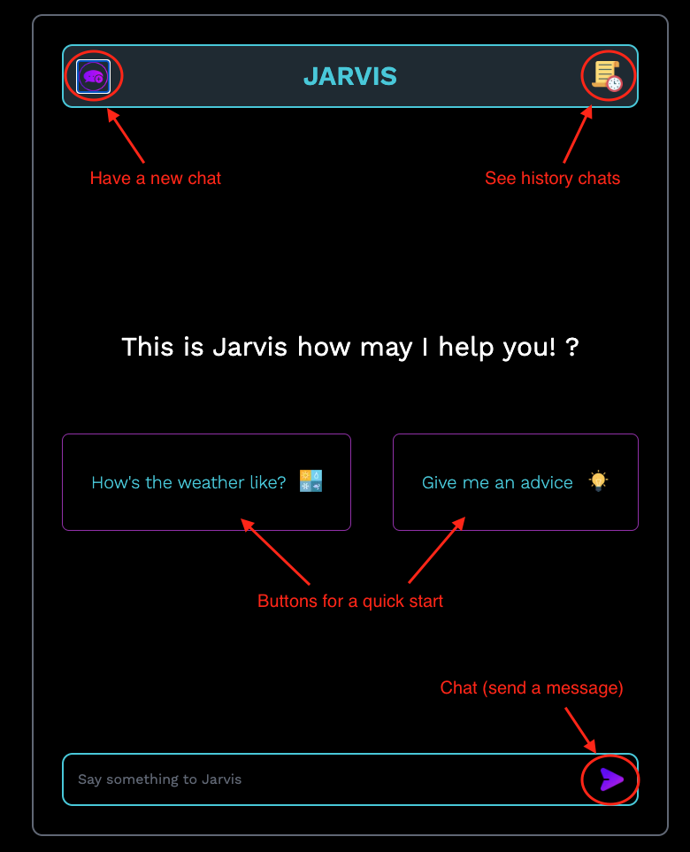
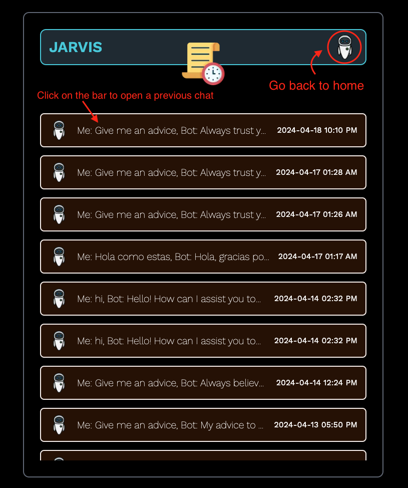
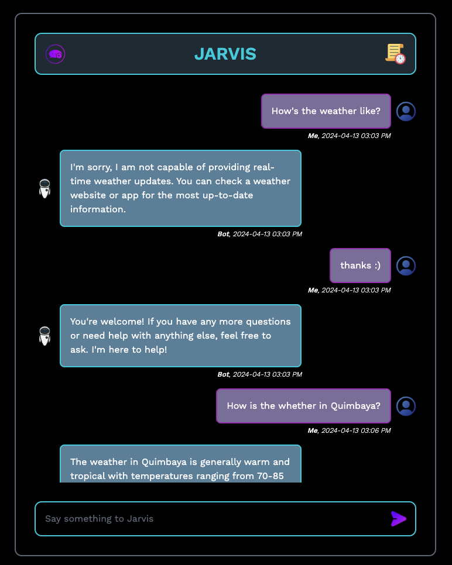
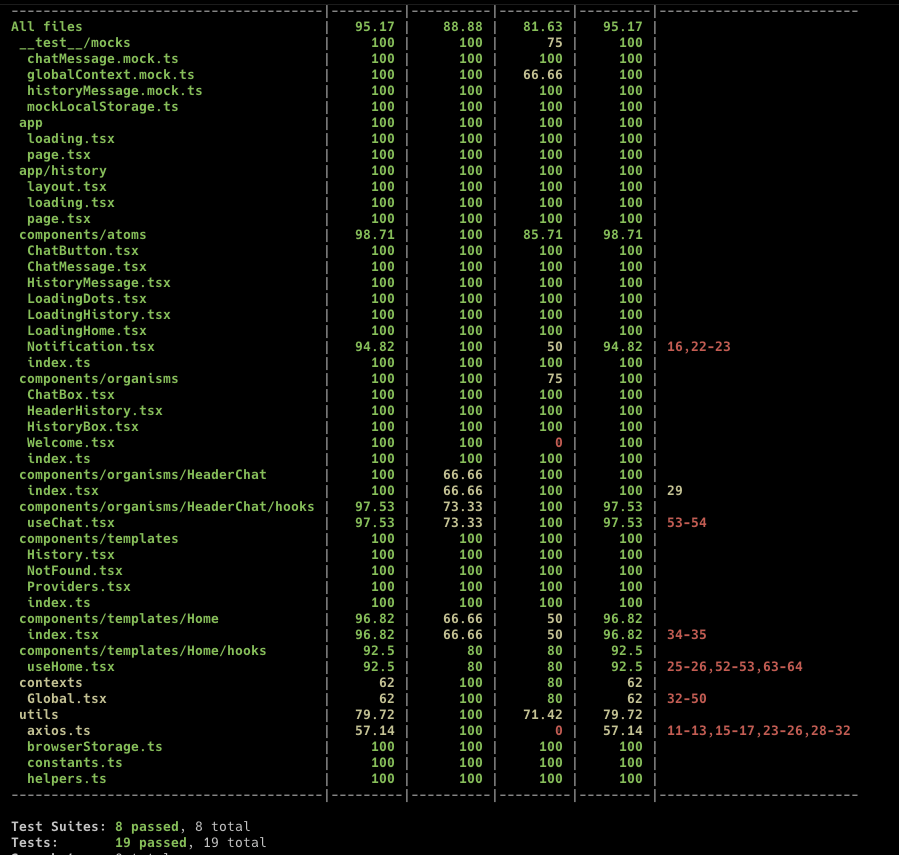
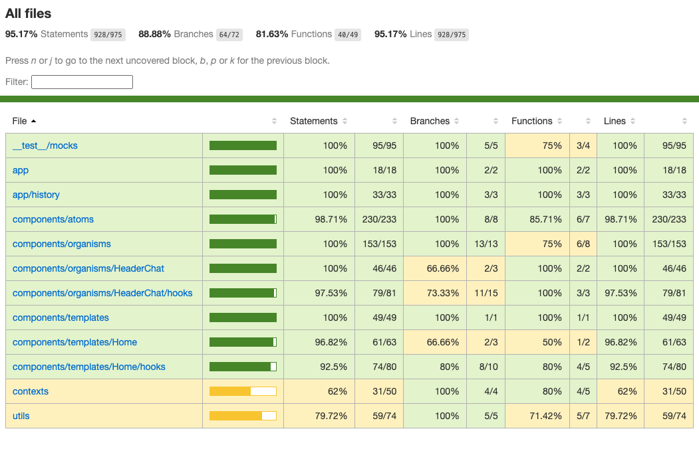

## Getting Started

Following the main commands to run the **Jarvis** app:

```bash

# Run loaclly and go to http://localhost:3000/
yarn dev
# Run tests
yarn test
# Run coverage report
yarn coverage
# Run EsLint
yarn lint
```

Open [http://localhost:3000](http://localhost:3000) with your browser to see the result.

## App guide

#### Home page



#### History page



#### Chat page



## Test and Coverage

#### Test coverage



#### Coverage report

To see coverage report

- First execute `yarn coverage`.
- Then go to coverage generated folder at root. Go to `coverage/Icov-report/index.html`. Take `index.html` and _drag_ and _prop_ it on the browser.


